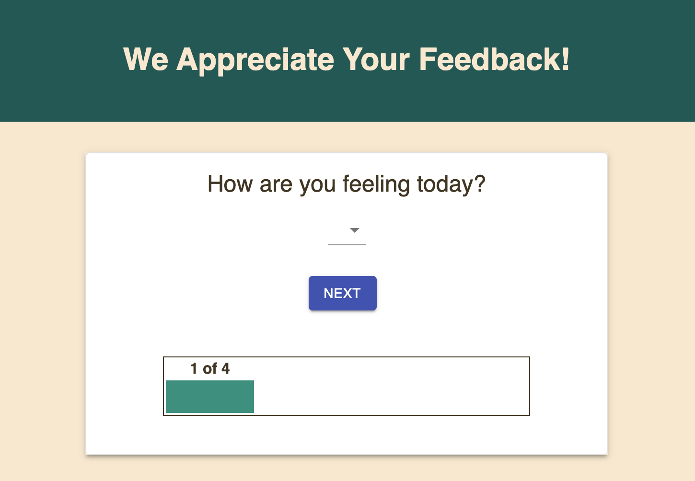
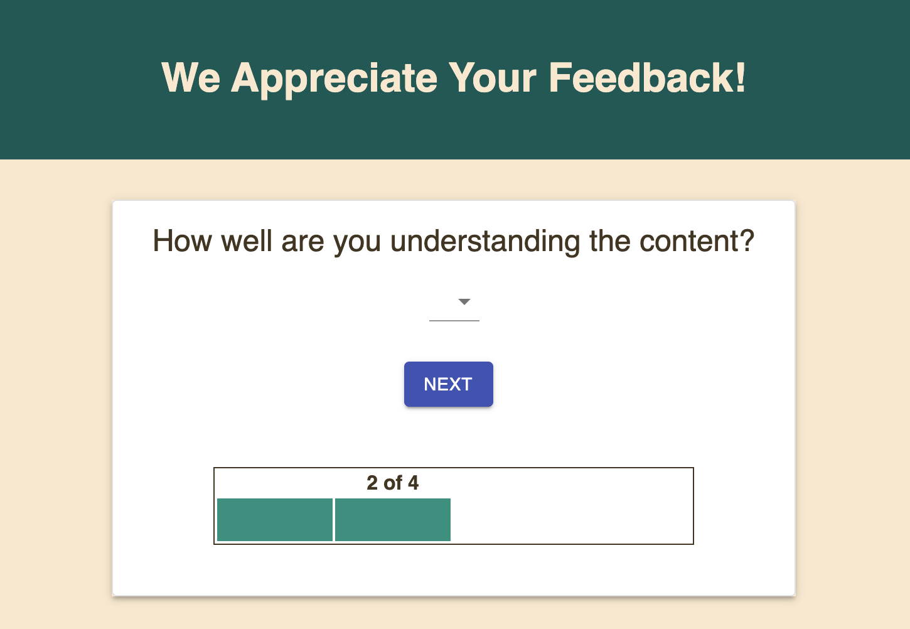
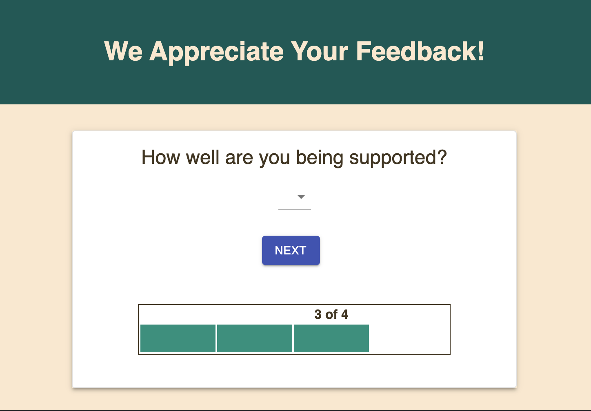
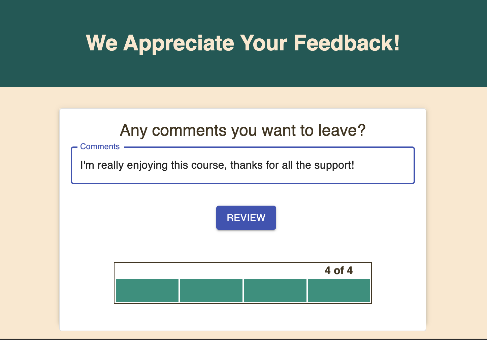
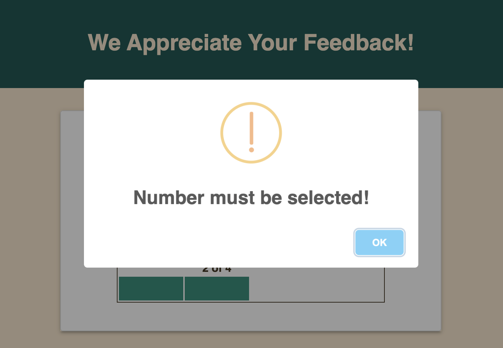
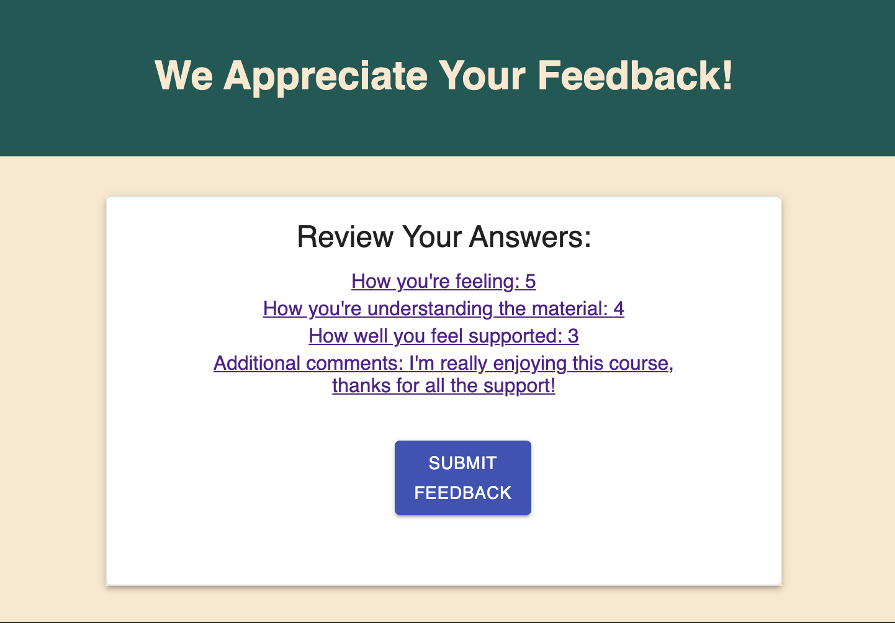
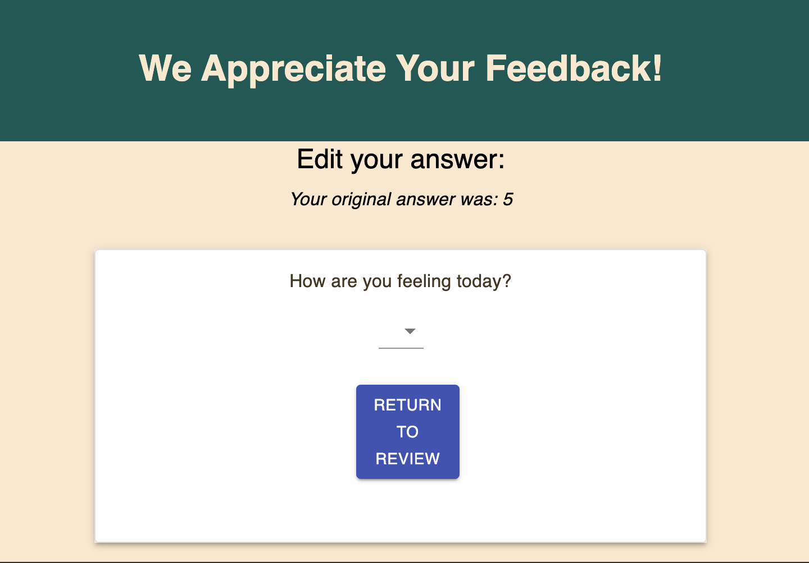
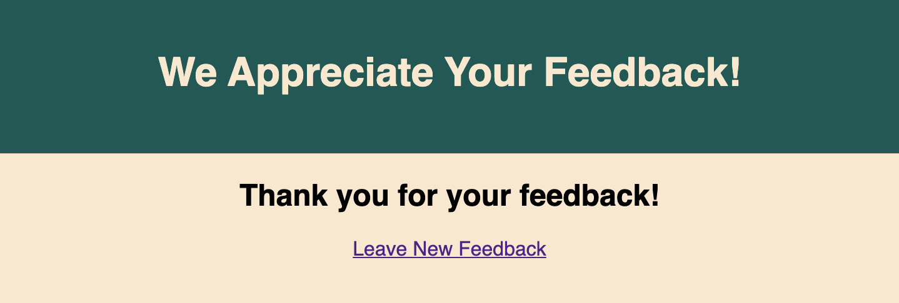
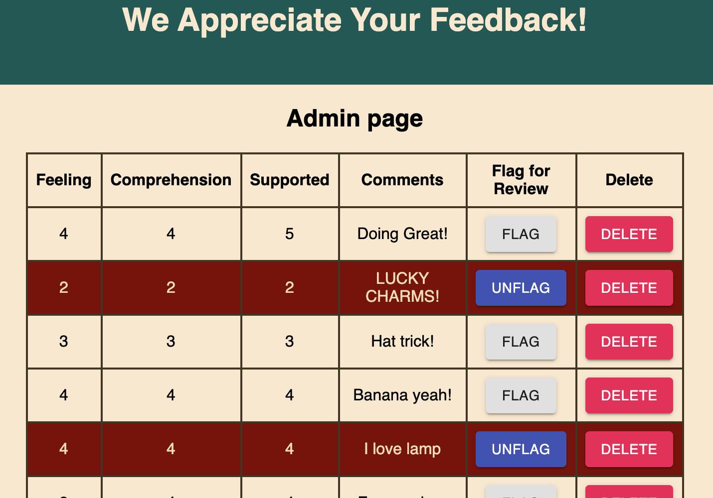
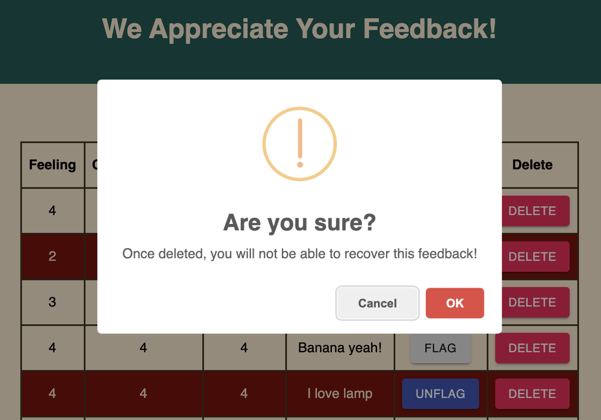

# Feedback Forms

## Description

_Duration: Weekend Sprint_

This application serves as a form for collecting feedback about an organized learning program.  There are 4 questions, each asked on their own page, for which the user's input is collected and stored in the database.  The user has a chance to review and edit their answers before submitting.  At the end, they are able to start a new review, if they choose.

Here is a view of the four pages of questions:

Users must make a selection on questions 1-4 in order to move on to next page:

This is the review page the user will see when they have completed questions 1-4:

If a user clicks one of the questions on the review page, they will be brought to a page to edit their input:

Once the user has submitted their answers from the review page, they will be brought to a "Thank you" page where they can opt to leave a new feedback:

The admin is able to see a list of all historical feedback collected, as well as flag any feedback for further review, or delete any feedback (the admin must verify that they intended to delete):

## Installation

1. Clone this repository and open in your favorite code editor (VS Code was used for creating this app).
1. Run 'npm install' in your terminal to bring in the necessary dependencies (don't worry, I've already got a nifty .gitignore file to avoid committing and pushing the massive node_modules!).
1. Create a database on your local server (Postico was used during creation).
   1. IMPORTANT: your database needs to be named prime_feedback in order to communicate with the current code.
   1. Copy all of the text in the attached database.sql module and insert it into the SQL Query box of your prime_feedback database.
   1. You can either execute this SQL statement as an entire block, or do them one by one from the top down (important that these are done sequentially in this case).
1. You will need multiple Terminal tabs open:
    1. Run "npm run server" in one to start the server - you should see "Listening on port: 5000" when the server is successfully running.
    1. Run "npm run client" in a second terminal.  You should see "Compiled successfully!" and your browser will automatically open the App.

## Usage

1. The user will start out on the first page of the app, which displays the question "How are you feeling today?".  There is a dropdown menu that allows the users to select the rating of how they feel on a scale of 1-5.  Once they choose their rating, they can hit NEXT to move on the the second question.  If the dropdown selection is left blank, the user will be alerted to make a selection, which they must do before moving on to the next question.

1. When the user clicks the NEXT button after answering the first question, they are brought to the second page which displays the question "How well are you understanding the content?"  Again, the user will give a rating between 1-5 from a dropdown menu, and cannot move on to the next page until they have made a selection and clicked the NEXT button.

1. When the user clicks the NEXT button after answering the second question, they are brought to the third page which displays the question "How well are you being supported?"  Again, the user will give a rating between 1-5 from a dropdown menu, and cannot move on to the next page until they have made a selection and clicked the NEXT button.

1. When the user clicks the NEXT button after answering the third question, they are brought to the fourth page which allows them to leave additional comments.  The user may leave this box blank if they choose.  When they are finished writing their comment, they click the REVIEW button to move on to the review page.

1. The review page lists a summary of the questions asked alongside the corresponding answers the user gave.  These are hyperlinked, and the user may click on any question summary on the review page to edit the answer they initially gave.

1. When the user clicks on any of the questions on the Review page, they are routed to a page that allows them to edit their answer, and also gives them a reminder of what they previous chose.  Once they choose a new answer (questions 1-3 still cannot be left blank), they click the 'Return to Review' button to see the review page again.  The review page will now hold any new inputs they selected, along with any unchanged scores from other questions.

1. Once the user approves the summary of feedback on the review page, they click 'Submit' and their feedback will be saved in the database.  They are taken to a submission success page, where they have the opportunity to click the 'Leave New Feedback' link to start this process over.

1. Their is also an admin view found at the /admin route path.  The admin page lists a table with all feedback ever stored in the database (and not deleted) listed in chronological order, with oldest feedbacks listed at the top.  The admin can flag a feedback for review, which will turn that table row maroon.  They can unflag that same feedback.  The admin can also delete any individual feedback.

## Built with:

- CSS
- JavaScript, JSX
- React.js 
- Redux
- Node.js 
- Express.js 
- JSON 
- PostgreSQL 
- SQL 
- Postico 
- Postman

## Acknowledgement

Thanks to [Prime Digital Academy](https://www.primeacademy.io/) who equipped and helped me to make this application a reality.
